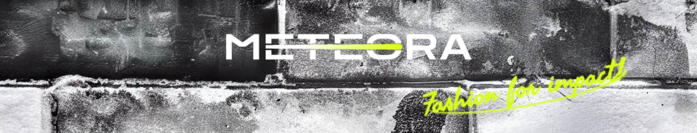

 
 <br></br>

 


<br></br>

<h1 style="color:#f9f9f9;">💻 Sobre o projeto</h1>

<p  style="color:#f9f9f9;font-size:16px;">
👓 Meteora - A Meteora é uma empresa do comércio eletrônico de roupas atemporais, casuais e sem gênero. Ela acredita que a moda é muito mais do que apenas tendências passageiras e oferece peças versáteis que se adaptam a qualquer estilo e ocasião.
</p>

<p style="color:#f9f9f9; font-size:16px;">
 Projeto desenvolvido baseado no layout da sétima edição do challenge Front-end da Alura.
</p>

<h1 style="color:#f9f9f9;">🛠️  Tecnologias</h1>

<p style="color:#f9f9f9; font-size:16px;">
As seguintes ferramentas foram usadas na construção do projeto:
</p>

<ul>
    <li style="color:#f9f9f9;"><a href="https://pt-br.legacy.reactjs.org/">ReactJs</a></li>
    <li style="color:#f9f9f9;"><a href="https://developer.mozilla.org/pt-BR/docs/Learn/Getting_started_with_the_web/HTML_basics">HTML</a></li>
    <li style="color:#f9f9f9;"><a href="https://developer.mozilla.org/pt-BR/docs/Web/CSS">CSS</a></li>
    <li style="color:#f9f9f9;"><a href="https://developer.mozilla.org/pt-BR/docs/Learn/JavaScript">Javascript</a></li>
    <li style="color:#f9f9f9;"><a href="https://my-json-server.typicode.com/">My json-server</a></li>
</ul>

<br></br>

<h1 style="color:#f9f9f9;">🚀 Como executar o projeto</h1>

<h2 style="color:#f9f9f9;"> Pré-requisistos</h2>
<p style="color:#f9f9f9; font-size:16px;"> 
É necessário utilizar um editor de código do seu gosto para rodar o projeto, mas recomendo o vs code onde o projeto foi construído.
</p>

<h2 style="color:#f9f9f9;"> 🧭 Rodando a aplicação web</h2>

<br></br>   

```bash

# Clone do repositório

$ git clone https://github.com/Feehh32/meteora.git 

# Você pode fazer também o download dos arquivos do repositório indo até a página deste reposiório no github e clicando no botão code e em seguida no dowload ZIP

# Vá até a pasta do projeto no seu terminal

$ cd meteora

# Abra a pasta no seu visual studio code

$ code .  

# na pasta raiz do projeto no seu terminal (ou no terminal integrado do seu vs code) instale as dependencias do projeto 

$ npm install 

 # Rode agora a aplicação em modo de desenvolvimento 

 $ npm start

 # A aplicação será aberta na porta:3000 - acesse http://localhost:3000 

``` 

<h1 style="color:#f9f9f9;">📝 Licença </h1>   

<p style="color:#f9f9f9; font-size:16px;">Este projeto esta sobe a licença MIT.</p>

<p style="color:#f9f9f9; font-size:16px">
Você pode vizualizar o projeto online <a href="https://meteora-fawn.vercel.app/">Aqui</a>
</p>

<p style="color:#f9f9f9; font-size:16px">
Feito com ❤️ por Fernando Pereira <a href="https://www.linkedin.com/in/fernando-pereira-710448247/">👋🏽 Entre em contato!</a>
</p>
